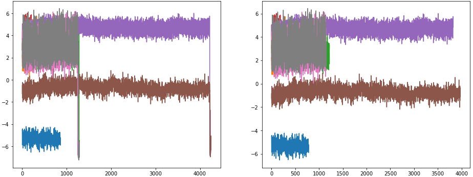
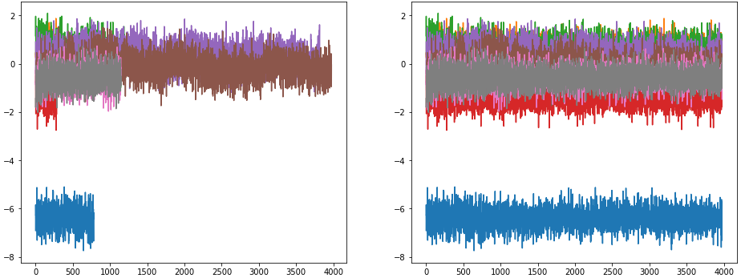
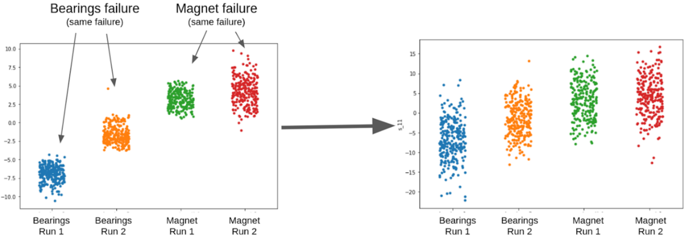
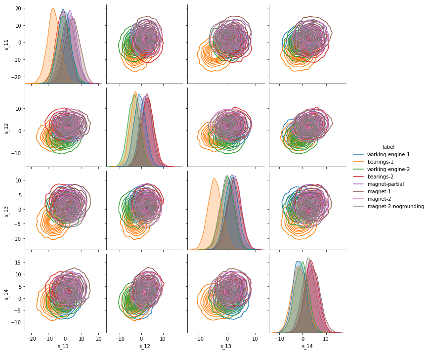
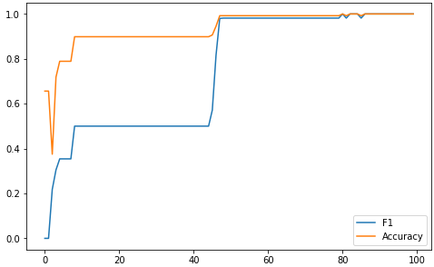
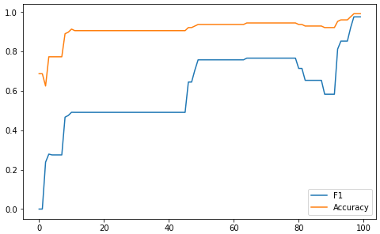
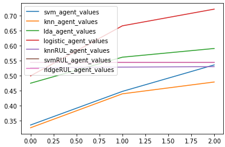
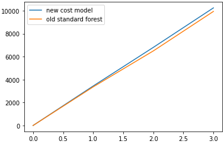

# Smart elevator
Analyze data coming from your elevator.

## Why and What
Everythink in the [report](report.pdf).

## Glances

### **Outlier removal**

    

### **Data generation**

    

### **Noise addition**

    

### **Data visualization** with pairplot

    

### **Model prediction** SVM and KNN

    
    

### **Multi-model prediction**

    

### **Ensamble with new cost function**

    

## Who
- **Davide Cappellaro**, Data Engineer, Master student in Data Science, Bachelor degree in Interfacce e tecnologie della comunicazione
- **Dimitri Vinci**, Master student in Artificial Intelligence System, Bachelor degree in Informatics
- **Giorgia Rossato**, Master student in Mathematics and Statistics for Life and Social
Sciences
- **Jhonny Hueller**, Master student in Artificial Intelligence System, Bachelor degree
in Informatics
- **Marco Di Francesco**, Junior Data Scientist at FBK, Bachelor student in Computer
Science

## How
Insallation steps:
- Install the Linux package `python3.9-dev` (to build scikit-survival)
- Install Python packages from `requirements.txt`

Usage:
- Run the notebooks 0 .. 9
